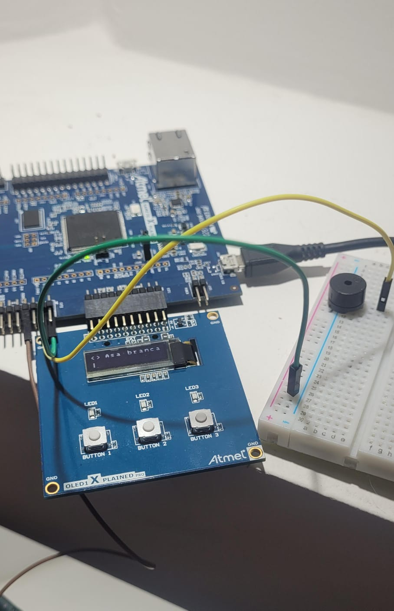

# 21a-emb-aps1

Embarcados - APS 1 - Musical!

Para maiores informações acesse:

https://insper.github.io/ComputacaoEmbarcada/APS-1-Musical/

Issues serão abertos neste repositório para guiar o desenvolvimento
da dupla. **Vocês não devem fechar os issues, apenas a equipe de professores!**, porém devem referenciar nos commits quando um issue
foi concluído! Isso gerará um PR no classroom que será avaliado pela equipe.

## Documentação

TODO: Aualizar pinos

| Função  | PINO |
| ------- | ---- |
| BUZZER  | PC13 |
| START   | PD28 |
| SELEÇÃO | PC31 |

### Imagem da montagem

### Vídeo do projeto

[Projeto funcionando](https://www.youtube.com/shorts/RtZlsG7LDtw)!

### Músicas e Direitos autorais

Todas as músicas foram retiradas do repositório [https://github.com/robsoncouto/arduino-songs](https://github.com/robsoncouto/arduino-songs)
